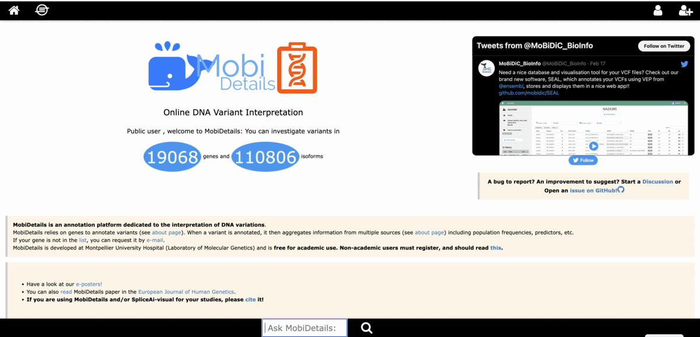

# MobiDetails

MobiDetails is a webapp which intends to aggregate data on DNA variants in order to help with their interpretation.

It consists in a website where users can easily create variants and retrieve many information.

It also includes an API for programmatic access.

https://mobidetails.chu-montpellier.fr

Access to the Swagger API:

http://mobidetails.chu-montpellier.fr/MDAPI/

Please cite:

Baux, D., Van Goethem, C., Ardouin, O. et al. MobiDetails: online DNA variants interpretation. Eur J Hum Genet (2020).

MobiDetails includes an implementation of SpliceAI-visual, that can be specifically cited:

De Sainte Agathe, J-M., Filser, M. at al. SpliceAI-visual: a free online tool to improve SpliceAI splicing variant interpretation. Hum genomics (2023).

Animated gif by [Char-Al](https://github.com/Char-Al).

